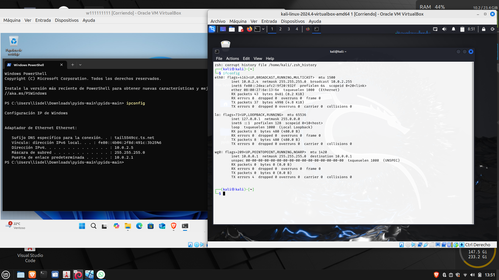
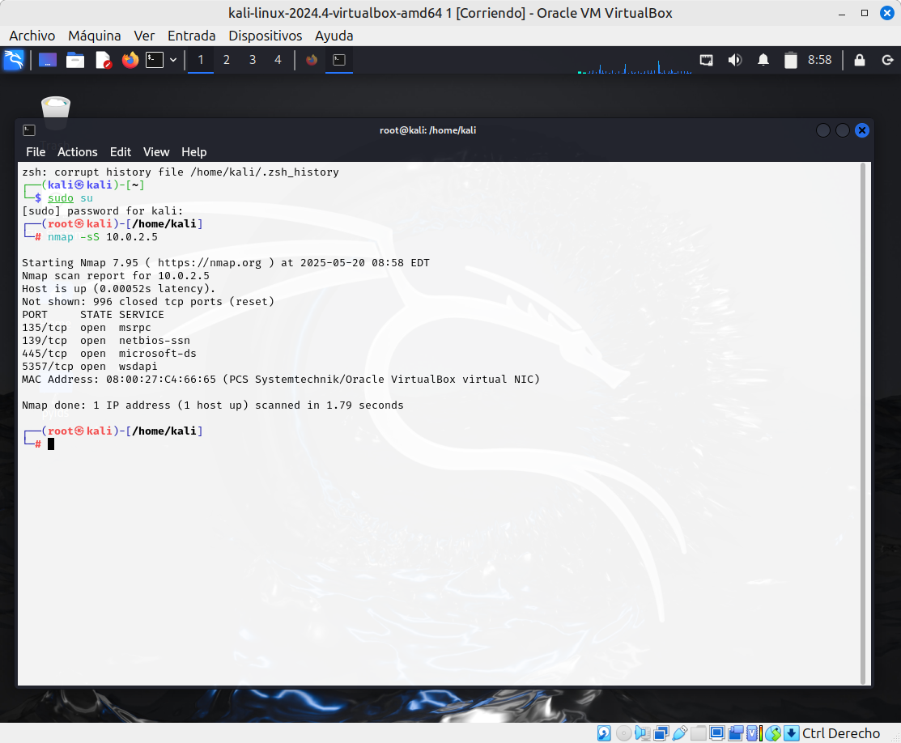
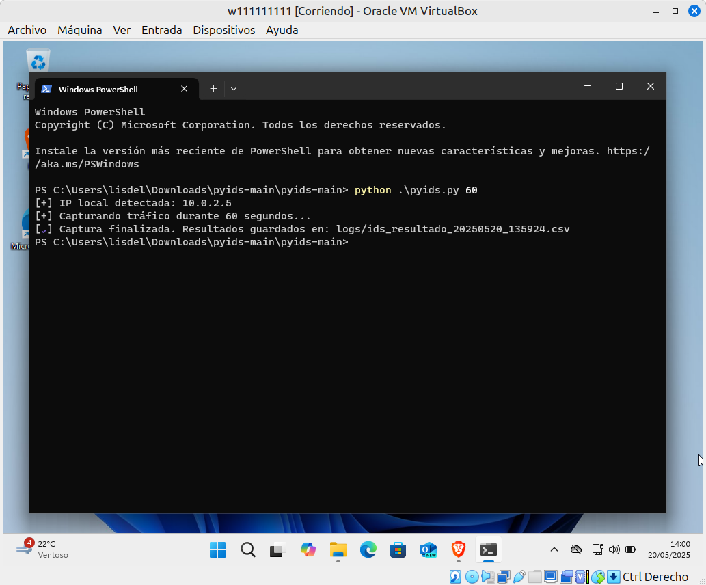
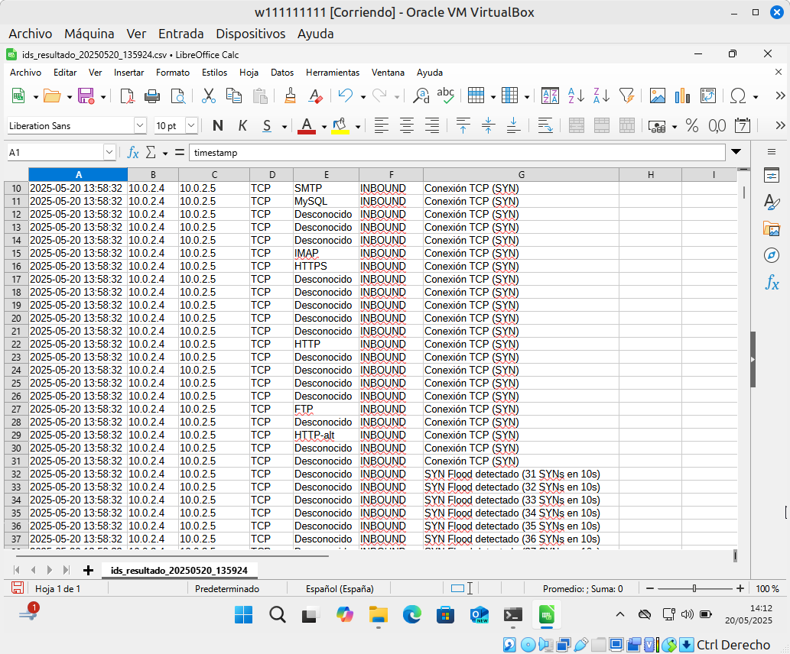

# PyIDS – IDS básico en Python

PyIDS es un pequeño sistema de detección de intrusos (IDS) desarrollado en Python, que permite analizar el tráfico de red en tiempo real, detectar servicios conocidos (HTTP, SSH, DNS...) y alertar sobre posibles ataques como SYN Flood. Al finalizar, guarda los eventos detectados en un archivo `.csv` compatible con LibreOffice Calc, Excel u otros lectores.

---

## 🧰 Requisitos

### 📦 Dependencias de Python
Solo necesitas dos librerías:

```
pip install -r requirements.txt
```

Contenido de `requirements.txt`:
```
scapy
pandas
```

---

## 🖥️ Instalación y uso

### 1. Clona el repositorio
```
git clone https://github.com/LisdelRosales/pyids.git
cd pyids
```

### 2. Ejecuta el script
Ejemplo para capturar durante 60 segundos:
```
python pyids.py 60
```

> 🗂 Los resultados se guardarán en la carpeta `/logs` automáticamente.

---

## ⚠️ IMPORTANTE según tu sistema operativo

### 🪟 Windows:
Debes instalar [Npcap](https://npcap.com/#download) con estas opciones activadas:
- ✅ **Install Npcap in WinPcap API-compatible Mode**
- ✅ (opcional) **Support raw 802.11 traffic** si usarás redes WiFi

Esto permite que `scapy` pueda capturar tráfico correctamente.

### 🐧 Linux:
No necesitas instalar nada adicional si tienes privilegios de `sudo`. Ejecuta el script con:
```
sudo python3 pyids.py 60
```

Para ver tu interfaz de red:
```
ip a
```

---

## 📊 Qué registra el script

Cada alerta contiene:
- `timestamp`: Fecha y hora
- `source_ip` y `dest_ip`
- `protocol`: TCP o UDP
- `service`: Tipo de servicio (HTTP, SSH, DNS...)
- `direction`: INBOUND / OUTBOUND / EXTERNO
- `alert`: Descripción del evento detectado

---

## 📷 Ejemplo de funcionamiento

### 1. Escenario de prueba con ambas máquinas virtuales
Muestro 2 máquinas virtuales confuguradas en RedNat para la prueba



---

### 2. Kali Linux lanzando escaneo con `nmap`
Ataque simulado usando:
```
nmap -sS 10.0.2.X
```



---

### 3. Confirmación en consola de PyIDS en Windows
Muestra el guardado exitoso del CSV después de la captura de tráfico:



---
### 4. Resultado CSV generado por PyIDS
Se puede observar el tráfico entrante clasificado como `INBOUND` con alertas como `Conexión TCP (SYN)` y detección de `HTTPS`.



---

## 💬 Sobre el autor

Este script fue desarrollado durante el Certificado de Profesionalidad en Seguridad Informática, como evolución de prácticas realizadas con Snort. El objetivo fue crear una herramienta ligera que pueda detectar tráfico y exportarlo directamente en formato CSV, sin depender de interfaces complicadas.
